# これはなに？
terraformのmoduleの練習のために作成したコード群です。  
network、IAM、ec2の3つのモジュールを用意し、ec2がその他2つの値を読み込む構成です。

# 実行したらどうなるの？
このような構成が出来上がります。  
EC2へセッションマネージャ経由のアクセスが可能です。

# 使い方は？
ルートディレクトリの`main.tf`の以下箇所を編集して下さい。  
入力する値は変数名そのままです。

## networkモジュール
- cidr_vpc
- cidr_public1
- cidr_public2
- az_public1
- az_public2

## ec2モジュール
- ami
- instance_type